# RecycleRight

[](https://github.com/RecycleRightCSE403/RecycleRight/actions/workflows/flutter_test.yaml)

## Overview

An Android app built to help you decide how to dipose of your trash. Simply
point your camera at whatever you need to dispose of and Recycle Right will 
quickly tell you how to do so, whether it be recyclable, compostible or garbage.

See our **[Requirements Document](https://docs.google.com/document/d/1-tRQytuJMfVyZsZzoSbtWy3YtfJzyljXGPqbyxGmIrc/edit?usp=sharing)** for details on requirements, toolset, team roles, and more.

This is a group project for [CSE 403](https://courses.cs.washington.edu/courses/cse403/24wi/), Software Engineering, at the University of Washington.

For instructions on how to download, install, and use our app, see the [user's guide](#users-guide) below.

## Contents

 * [Overview](#overview)
 * [Developer's Guide](#developers-guide)
    + [Setup](#setup)
    + [Development](#development)
    + [Troubleshooting](#troubleshooting)
    + [Development Guidelines](#development-guidelines)
 * [User's Guide](#users-guide)
    + [Installation](#installation)
    + [Updating](#updating)
    + [Usage](#usage)
    + [Support](#support)

## Developer's Guide

### Setup

1. Clone the repository
    ```git clone git@github.com:RecycleRightCSE403/RecycleRight.git```

#### Frontend

1. Download and install [Android Studio](https://developer.android.com/studio)
2. Follow [Flutter's guide](https://docs.flutter.dev/get-started/install) to install and setup Flutter development
   1. Choose your operating system and then select Mobile or Android development if prompted
   2. Make sure to follow the Android Emulator setup instructions
   3. Once running `flutter doctor` produces the output described by the tutorial, you're good to go!
4. In a terminal, change to `frontend/recycleright/` directory
5. Install dependencies: `flutter pub get`

#### Backend

1. Pre-requisite: Python >=3.9 installed and available on your system path
2. In a terminal, change to the `backend/` directory
3. Create a virtual environment: `python -m venv venv`
4. Activate the virtual environment (see [Python venv](https://docs.python.org/3/library/venv.html))
   1. Unix bash: `source venv/bin/activate`
   2. Powershell: `./venv/Scripts/Activate.ps1`
   3. CMD: `./venv/Scripts/Activate.bat`
5. Install dependencies: `pip install -r requirements.txt`
6. Create a file `.env` in the backend directory with the following contents, inserting the secret values in their places:
   ```
   ROBOFLOW_API_KEY=<secret>
   GEMINI_API_KEY=<secret>
   ```
   1. Reach out to an organization member for api keys
   2. Or build your own object detection model on [Roboflow](https://roboflow.com/) and create your own Google Gemini API key at [Google AI Studio](https://aistudio.google.com/app/apikey)
  

### Development

#### Running on an emulator:

1. Start an Android Emulator through Android Studio
2. In a terminal, in the `backend/` directory, activate your venv (see above) and run
   ```uvicorn main:app --reload```
   1. If uvicorn is not added to your path when activating your venv, you can replace `uvicorn` with `python -m uvicorn`
4. In a separate terminal window, in the `frontend/recycleright/` directory, run
   ```flutter run```

#### Running on a physical device:

1. Connect your android device to your computer via USB or WiFi pairing
2. In a terminal, in the `backend/` directory, activate your venv (see above) and run
   ```uvicorn main:app --reload --host <YOUR_COMPUTER_IP_ADDRESS>```
4. In a separate terminal window, in the `frontend/recycleright/` directory, run
   ```flutter run --dart-define SERVER_BASE_URL="http://<YOUR_COMPUTER_IP_ADDRESS>:8000/"```

#### Run frontend tests:

1. In the `frontend/recycleright/` directory, run:
  ```flutter test```

#### Run backend tests:

1. In the `backend/` directory, run:
```python -m pytest```

### Troubleshooting

#### Frontend

* Run `flutter doctor` and follow any recommended steps
* Run `flutter devices` to confirm an emulator or physical device has been recognized

#### Backend

* Make sure your virtual environment is activated (see [Python venv](https://docs.python.org/3/library/venv.html))
* Make sure you have environment variables for both api keys or both are saved in `backend/.env`
  + You should have `ROBOFLOW_API_KEY` and `GEMINI_API_KEY`
* Don't run `main.py` directly. Instead, run the server through the `uvicorn` module as described above.

### Development guidelines

#### Tests

* All features, interfaces, modules, and discovered bugs should have relevant and associated tests

To add a test on the frontend:
1. Navigate to `frontend/recycleright/test`.
2. Choose an existing file to add your test to or create a new file for your test.
3. Add a call to `test` to the main function in that file, optionally placing it inside a call to `group` to arrange related tests.
4. Use calls to `expect` to verify behavior.
5. For more details, see [Testing Flutter apps](https://docs.flutter.dev/testing/overview)
6. Minimal example (tests that 1 == 1):

```dart
import 'package:test/test.dart';

void main() {
  group('Test group', () {
    test('The truth', () {
      expect(1, 1);
    });
  });
}
```

To add a test on the backend:
1. Navigate to `backend/test`.
2. Choose an existing file to add your test to or create a new file for your test.
   1. The file name must start or end with `test` to be recognized by the pytest framework.
4. Add a function to the file that contains your test code.
5. Use `assert` statements to verify behavior.
6. For more details, see [Testing - FastAPI](https://fastapi.tiangolo.com/tutorial/testing/)
7. Minimal example (tests that 1 == 1):
```python
def test():
    assert 1 == 1
```

#### Style

* Code should be appropriately separated into modules
* Follow standard language style guidelines:
  + Python: [PEP 8](https://peps.python.org/pep-0008/)
  + Dart: [Effective Dart](https://dart.dev/effective-dart/style)
* Follow the repository structure:
  * [frontend](https://github.com/RecycleRightCSE403/RecycleRight/tree/main/frontend)
    * Contains the frontend Flutter Android app
  * [backend](https://github.com/RecycleRightCSE403/RecycleRight/tree/main/backend)
    * Contains the backend server implementation
    * [backend/cv](https://github.com/RecycleRightCSE403/RecycleRight/tree/main/backend/cv)
      * Contains our object detection model code for identifying objects
    * [backend/ml](https://github.com/RecycleRightCSE403/RecycleRight/tree/main/backend/ml)
      * Contains our LLM code for classifying identified objects into their waste type
     
## User's Guide

### Installation

Pre-requisites: The following instructions must be done on an Android Device running Android 5.0 (API level 21) or later.

Note: these screenshots and steps were created for a Pixel 7 Pro device. While most android devices will be very close to this appearance and functionality, some steps may look and behave slightly differently depending on your operating system and device. If you are unable to install the app, open an issue with a screenshot of the error and we will help troubleshoot the problem.

1. Visit [https://github.com/RecycleRightCSE403/RecycleRight/releases/latest](https://github.com/RecycleRightCSE403/RecycleRight/releases/latest) to access the latest version of the app
2. Under Assets, click on `recycle_right.apk` and download the apk file
   
   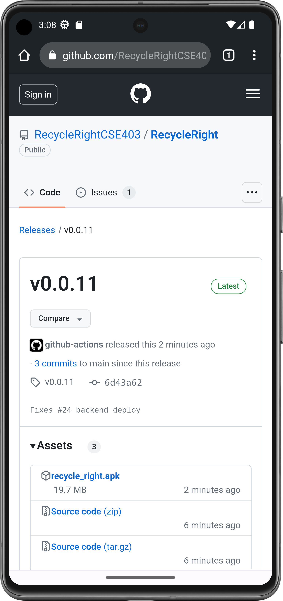
   
3. You will likely see a message about a harmful file type. Click Download anyway

   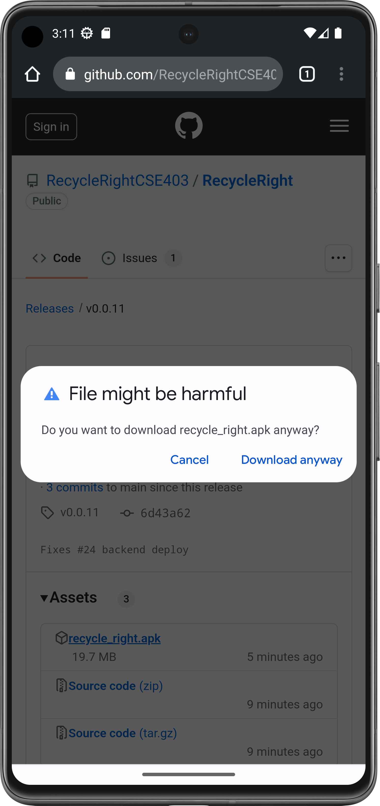
   
4. Open your downloads folder from your browser and click on the downloaded apk file
   
   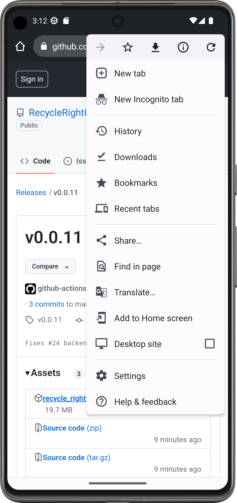
   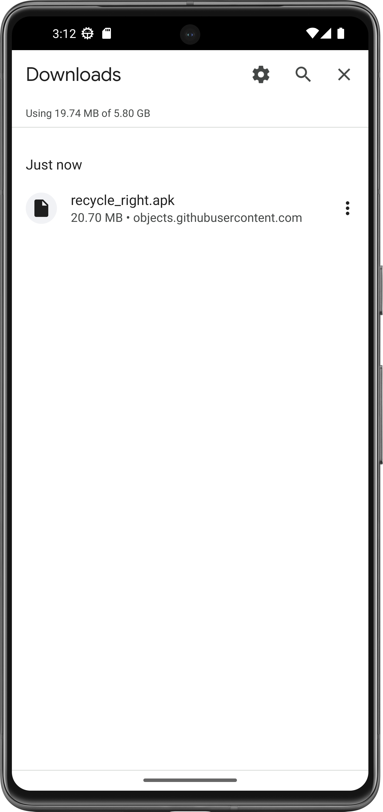

5. If prompted with a message about installing apps from this source, follow the link to your settings to allow the installation
   
   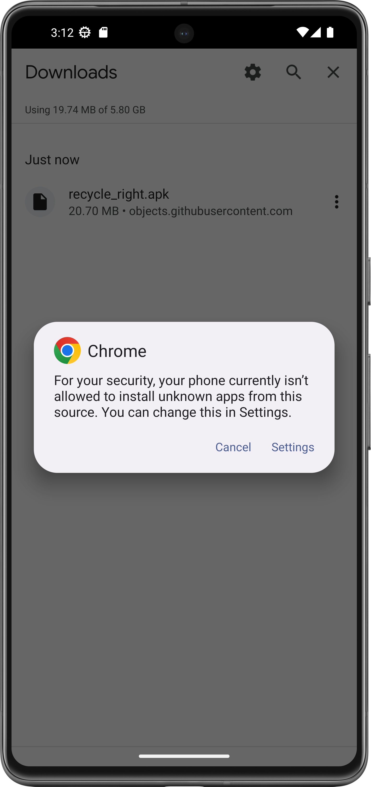
   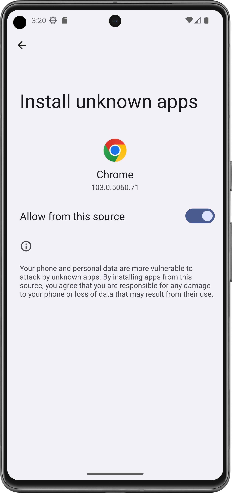
   
6. Once installation is allowed you should be prompted with a message to install recycleright, click on Install
   1. If you are not automatically prompted, return to step 3
   
   
   
7. Once installation finishes, click Open
   
   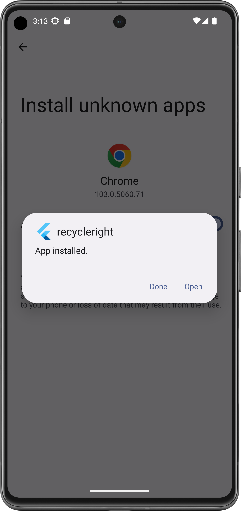
   
8. Click `While using the app` for both Video and Audio permissions when prompted
   
   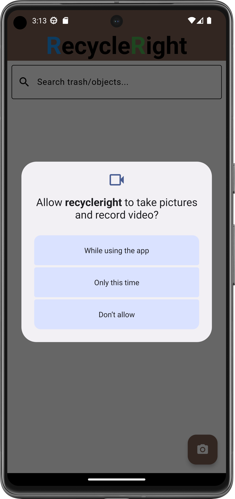
   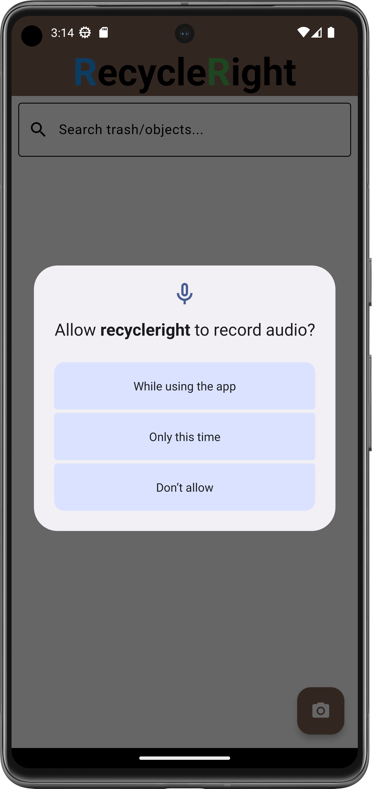
   
9. The app is now setup and ready to use!
   
   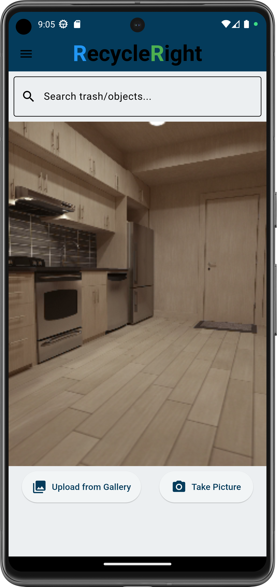

### Updating

To update, follow the same instructions above in the [installation](#installation) instructions. If you encounter an error, uninstall the old version before trying again. Some steps may only be necessary on the first install and can be skipped for upgrades.   

### Usage

Get a disposal suggestion for your item in three different ways:
1. Point your phone's camera and take a picture with the button in the bottom right
2. Upload your own picture from your camera roll with the button in the bottom left
3. Search for your item with text in the search box at the top

   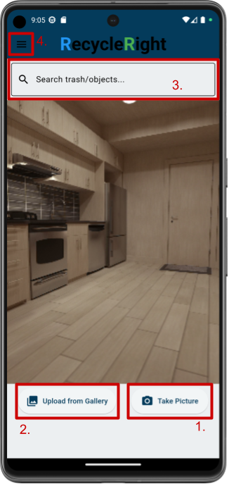

4. You can find more information about the app in the menu in the upper left

### Support

If you encounter an error or would like to suggest a feature, [open an issue](https://github.com/RecycleRightCSE403/RecycleRight/issues/new) in this repository and we will follow up with you.
